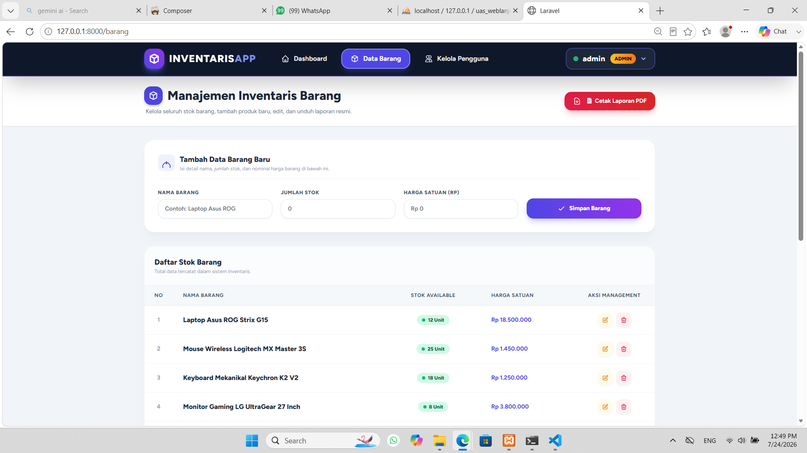
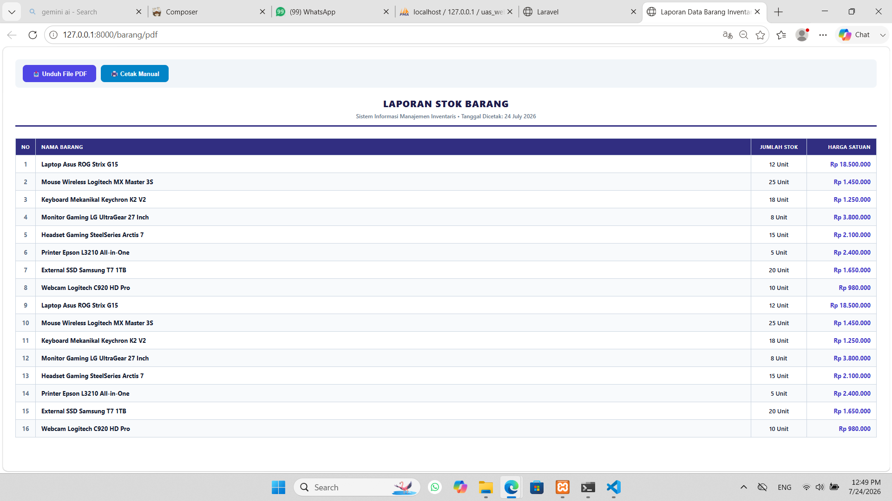

# 📦 InventarisApp - Sistem Informasi Manajemen Inventaris Barang

Aplikasi web manajemen stok inventaris barang yang dibangun menggunakan framework **Laravel** dan **Tailwind CSS**. Proyek ini dibuat untuk memenuhi tugas **Ujian Akhir Semester (UAS) Pemrograman Web Lanjut**.

---

## 👨‍💻 Identitas Mahasiswa
* **Nama:** Diva Insyarah Kausar
* **NIM:** 230170087
* **Mata Kuliah:** Pemrograman Web Lanjut A8S
* **Program Studi :** Teknik Informatika
* **Universitas :** Universitas Malikussaleh

---

## 🔥 Fitur Utama Aplikasi
1. **Autentikasi Pengguna (Authentication):**
   * Login, Register, Logout, dan Kelola Profil Pengguna via Laravel Breeze.
2. **Hak Akses Multi-Role:**
   * **Admin:** Akses penuh untuk Tambah, Edit, Hapus data barang, dan Kelola Akun Pengguna.
   * **User:** Hanya dapat melihat data barang, statistik, dan mencetak laporan.
3. **CRUD Data Barang:**
   * Pengelolaan data barang lengkap dengan stok dan harga satuan.
4. **Dashboard & Statistik:**
   * Ringkasan statistik jumlah barang, stok tersedia, dan nilai total inventaris.
5. **Export Laporan PDF:**
   * Fitur untuk mengunduh laporan data barang resmi berformat PDF.
6. **Responsive Design:**
   * Tampilan antarmuka mendukung mode Desktop dan Mobile Device.

---

## ⚙️ Panduan Instalasi Proyek

Jika ingin menjalankan proyek ini di komputer lokal:

1. **Clone Repository:**
   ```bash
   git clone [https://github.com/username-kamu/uas-web-lanjut-inventaris.git](https://github.com/username-kamu/uas-web-lanjut-inventaris.git)
   cd uas-web-lanjut-inventaris
   ```

2. **Install Dependensi PHP & Node.js:**
   ```bash
   composer install
   npm install
   ```

3. **Pengaturan File `.env`:**
   * Salin `.env.example` menjadi `.env`:
     ```bash
     cp .env.example .env
     ```
   * Sesuaikan konfigurasi database di file `.env`:
     ```env
     DB_DATABASE=uas-web-lanjut
     DB_USERNAME=root
     DB_PASSWORD=
     ```

4. **Generate Application Key & Database Migration:**
   ```bash
   php artisan key:generate
   php artisan migrate --seed
   ```

5. **Jalankan Aplikasi:**
   ```bash
   npm run dev
   php artisan serve
   ```
   Akses di browser melalui: `http://127.0.0.1:8000`

---
## 🔑 Akun Demo (Default Login)

| Role | Email | Password |
|---|---|---|
| **Admin** | `admin@gmail.com` | `password` |
| **User** | `user@gmail.com` | `password` |

---

## 📸 Dokumentasi Fitur Aplikasi

* **Halaman Login & Register**
  
  
  

* **Dashboard Admin & Pengaturan Profil**
  
  
  
  

* **CRUD Data Barang**
  
  

* **Hasil Export PDF**
  
  